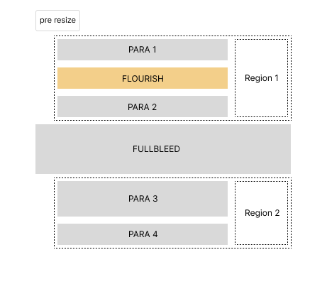
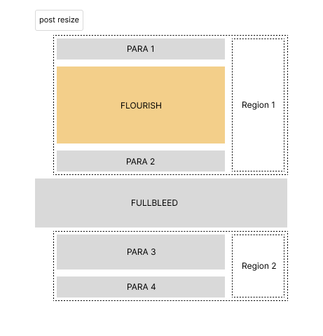

# Simplifying the Right Hand Rail

## Motivation

### Flexibility

Ads aren't the only elements we want to place in the RHR: FT Professional have started to develop contextual widgets, and more will likely follow.

Additionally, new content formats will inevitably need to be handled, so we need a solution that's agnostic to hitherto unseen class names or other characteristics that result in the RHR being intersected

### Maintainability

The current placement algorithm is bloated and brittle: it was originally developed to handle static fullbleed images that were fully loaded by the time it calculated the available positions. Since then, the need to accommodate highly asynchronous content like Flourish components has resulted in a lot of additional code, and with it complexity.

The new approach is far smaller, simpler and more robust. It's also more flexible, being applicable to any app that has a right hand rail (e.g. Search)

## Method

This approach splits content placement into two discrete tasks:

1. Item prioritisation
2. Item placement

### Item prioritisation

It is the consuming app's responsibility to apply its business rules to the array of candidate elements to sort them in priority order: when space is constrained, items cannot always be placed.

Once the array is ordered, it is handed off to the `RightHandRail` component for insertion into the DOM.

### Item placement

The responsibility of the `RightHandRail` component is restricted to managing the DOM. This amounts to the following:

- Identifying placement regions
- Inserting items into regions as spacing rules permit
- Repositioning regions when dimensions change

### Placement mechanism

We create "regions" by identifying the first and last elements in sequences of contiguous _non_-fullbleed content elements (e.g. paragraphs, images, etc). For each region a container div is then pinned to the `top` value of the first element, with its height set to the `bottom` of the last element in the run.

This makes for easier calculations and greater efficiency, since the element groupings can be cached.

These region containers become the parent elements for placed items, further reducing dev effort:
- The browser's flex layout engine spaces elements natively
- In the event of updates to content dimensions we can batch element position updates via their containers

A `ResizeObserver` handles any changes to article content height (e.g. when a child expands or collapses): all regions are re-anchored to their associated first and last elements. The demo allows you to see this in action with its "Toggle image sizes" control.

### Relevant files

- [`src/client/index.ts`](../client/index.ts)
- [`src/client/components/rhr.ts`](../client/components/rhr.ts)
